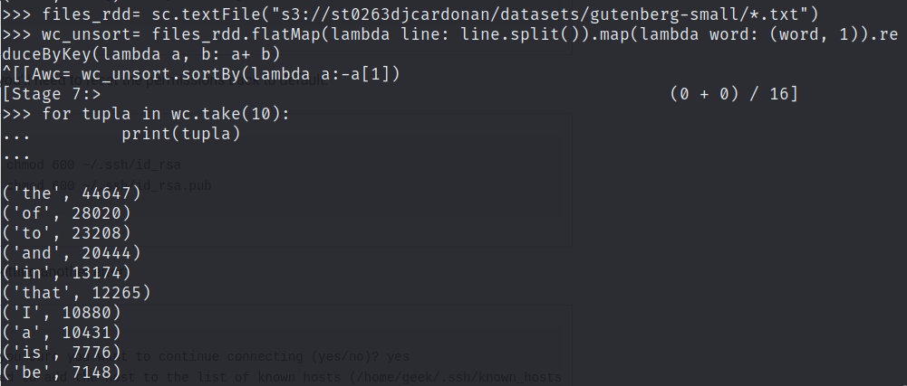
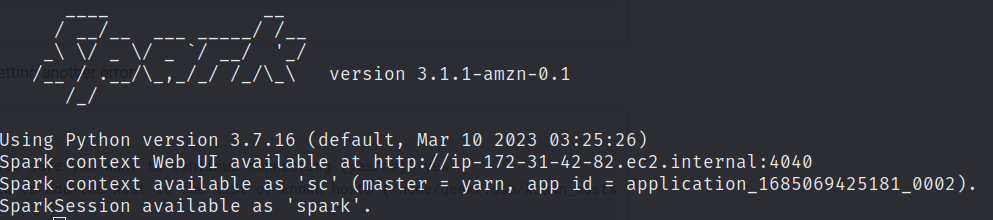
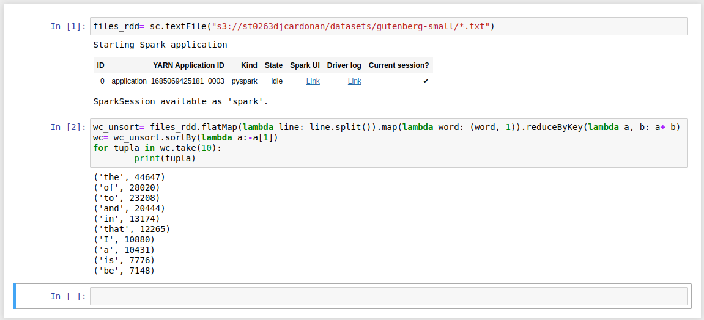

``` 
- ST0263, Laboratorio #5-3
- David José Cardona Nieves, djcardonan@eafit.edu.co
- Edwin Nelson Montoya Munera, emontoya@eafit.edu.co
```

## Terminal de Spark


## Wordcount por CLI en S3



## Wordcount por CLI en HDFS



## JupyterHub Notebook



## Explicación pasos

1. Primeramente importamos la clase SparkSession de la biblioteca pyspark.sql
2. Crear una instancia de SparkSession llamada "spark"
3. Cargar un archivo CSV en un DataFrame llamado "df"
4. Obtener el número de columnas del DataFrame
5. Obtener los nombres de las columnas de "df" 
6. Obtener el número de registros en el DataFrame
8. Imprimir el esquema del DataFrame
9. Mostrar las primeras 5 filas del DataFrame
10. Seleccionar solo 2 columnas ('age' y 'mobile') del DataFrame y mostrar las primeras filas
11. Mostrar información estadística sobre el DataFrame
12. Importar tipos de datos de la clase pyspark.sql.types
13. Agregar una nueva columna al DataFrame que calcule la edad después de 10 años
14. Agregar una nueva columna al DataFrame que convierta la columna 'age' a tipo Double
15. Filtrar registros del DataFrame donde el valor de la columna 'mobile' sea 'Vivo'
16. Filtrar registros del DataFrame que cumplan múltiples condiciones ('mobile' == 'Vivo' && 'experience' > 10)
17. Filtrar registros del DataFrame que cumplan múltiples condiciones usando operadores lógicos
18. Mostrar los valores distintos en la columna 'mobile'
19. Contar la cantidad de valores únicos en la columna 'mobile'
20. Agrupar por la columna 'mobile' y contar el número de registros en cada grup
21. Agrupar por la columna 'mobile' y calcular la media de cada columna numérica en cada grupo
22. Guardar el DataFrame como un archivo CSV
23. Guardar el DataFrame como un archivo Parquet