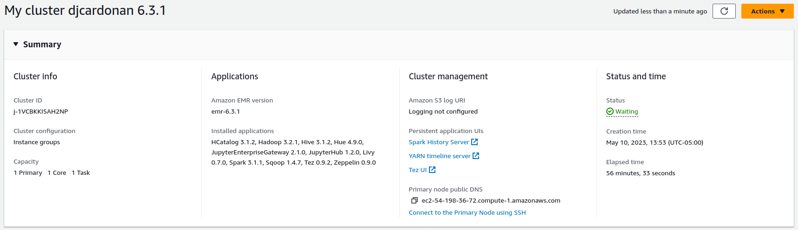
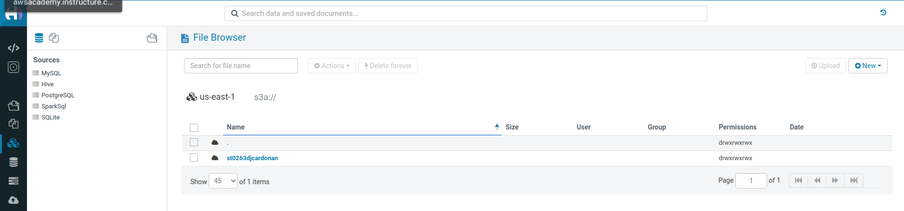
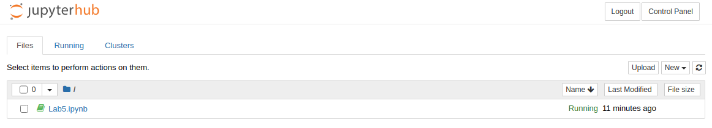
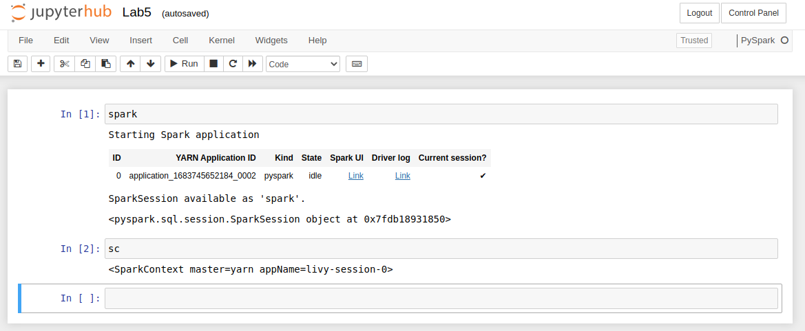
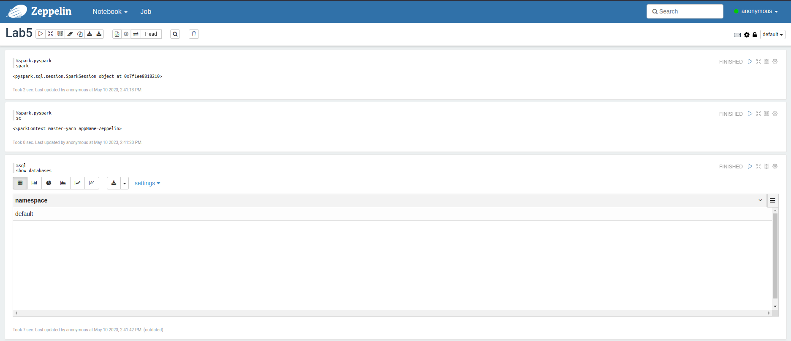
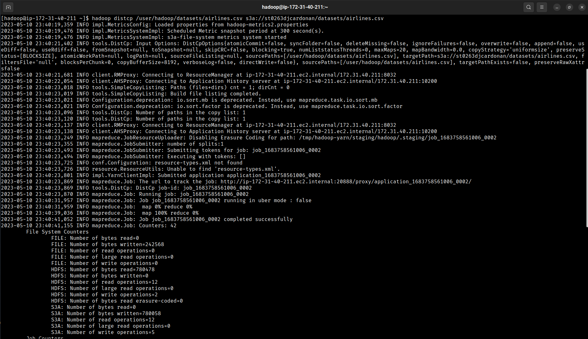
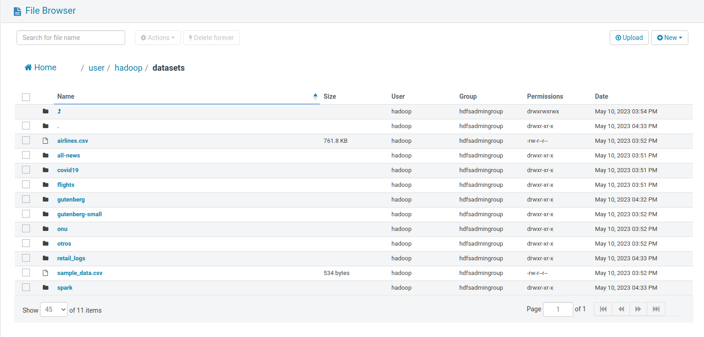
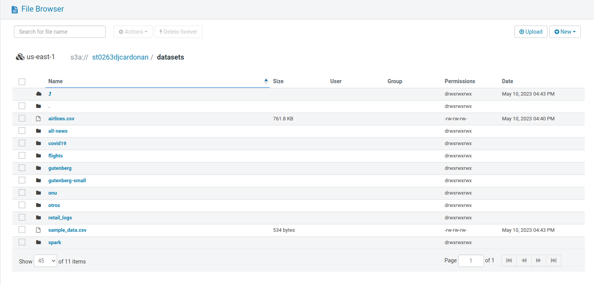

``` 
- ST0263, Laboratorio #5
- David José Cardona Nieves, djcardonan@eafit.edu.co
- Edwin Nelson Montoya Munera, emontoya@eafit.edu.co
```

# Laboratorio 5 (Sección #1 y #2)

### Configuración del cluster en AWS



### Pantalla de Hue



### Pantalla de JupyterHub



### Notebook JupyterHub



### Notebook Zeppelin



### Terminal (transferencia HDFS -> S3)



### Archivos en HDFS



### Archivos en S3

