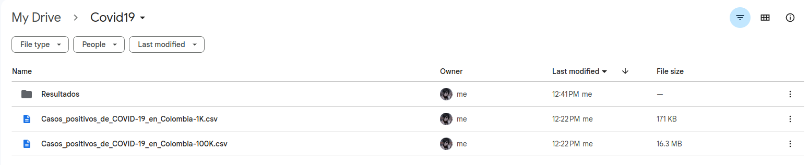
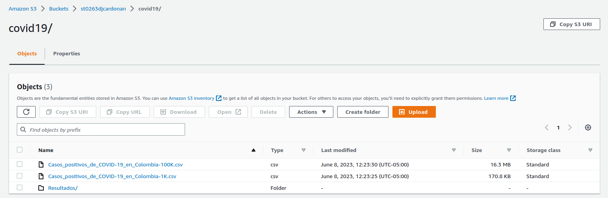
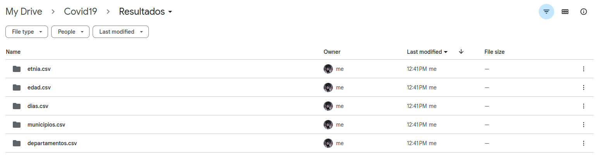
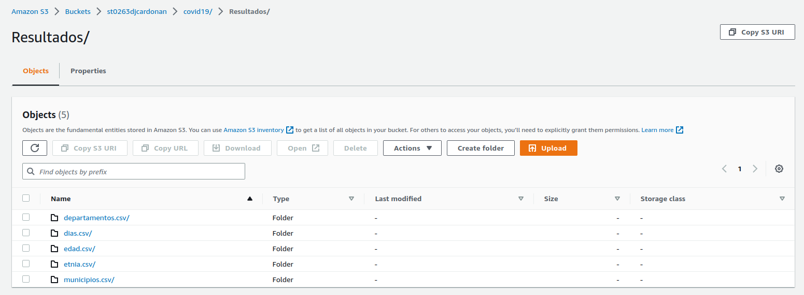

```
- ST0263, Lab #6-2
- David José Cardona Nieves, djcardonan@eafit.edu.co
- Edwin Nelson Montoya Munera, emontoya@eafit.edu.co
```

# Laboratorio 6.2

## Almacenamiento

### Almacenamiento en Google Drive



### Almacenamiento en AWS S3



## Procesamiento

### Procesamiento/análisis en Google Colab


### Procesamiento/análisis en Jupyter


## Resultados

### Resultados guardados en Google Drive



### Resultados guardados en AWS S3

