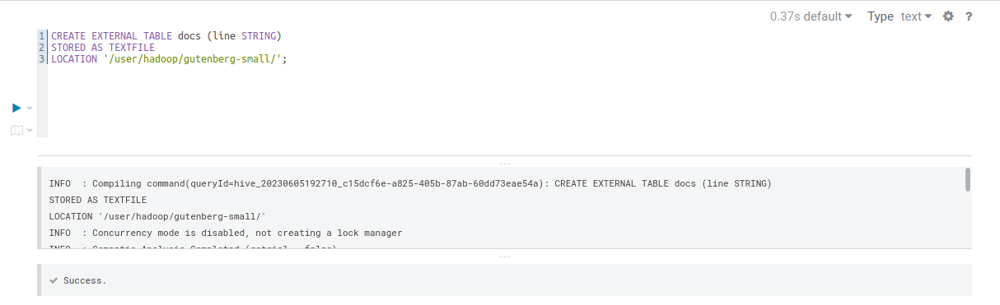

```
- ST0263, Lab #6
- David José Cardona Nieves, djcardonan@eafit.edu.co
- Edwin Nelson Montoya Munera, emontoya@eafit.edu.co
```

# 6.1 Hive

### _New ERM Cluster_


### _Load data natively_


### _Create external table_


### _Create external table in S3_


### _Select GNI both external and native_


### _Join results from two tables_


### _Create docs table both native and S3_





### _Select and order by word_


### _Select and order by frequency_


### _Create word frequency table_


### _Spark and hive run_

