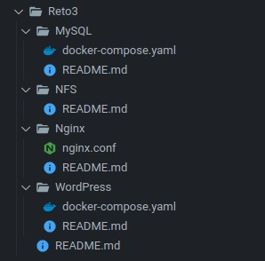
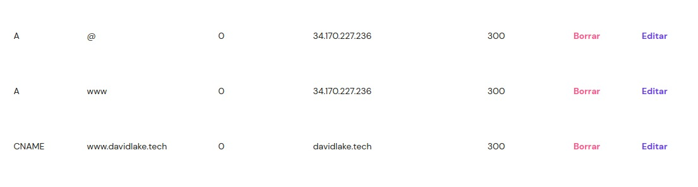
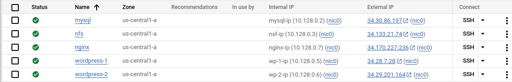

``` 
- ST0263, Reto 3 Aplicación Monolítica con Balanceo
  y Datos Distribuidos (BD y archivos)
- David José Cardona Nieves, djcardonan@eafit.edu.co
- Edwin Nelson Montoya Munera, emontoya@eafit.edu.co
```

# 1. Breve descripción de la actividad

## 1.1. ¿Que aspectos cumplió o desarrolló de la actividad propuesta por el profesor? (requerimientos funcionales y no funcionales)

- Una instancia de GCP con NGINX que equilibra la carga de las peticiones a las instancias de WordPress.
- Dos instancias de WordPress conectadas a la VM de NFS y referidas por la instancia de NGINX.
- Una instancia de GCP que actúe como NFS para compartir información entre las instancias de WordPress.
- Una instancia de GCP con una base de datos MySQL.
Un dominio en el que se puede acceder al sitio web: https://davidlake.tech
- Certificados SSL creados a través de certbot.

# 2. información general de diseño de alto nivel, arquitectura, patrones, mejores prácticas utilizadas.

La arquitectura de este proyecto se basa en la implementación de cinco nodos, cada uno de ellos representando una máquina virtual en GCP.

Cuando el cliente ingresa el dominio en su navegador, el browser busca la IP pública correspondiente a través de Hostinger, la plataforma utilizada para gestionar el DNS. Una vez obtenida la IP, Nginx entra en acción y realiza un balanceo de carga sobre los dos servidores de WordPress, los cuales dependen de un NFS server para el manejo de los archivos y un servidor de base de datos ubicados en la última instancia.

# 3. Descripción del ambiente de desarrollo y técnico: lenguaje de programación, librerias, paquetes, etc, con sus numeros de versiones.

## 3.1) Sistema Operativo

Las cinco instancias están configuradas para trabajar con Ubuntu 22.04 x86.

## 3.2) Dependencias

Dentro de cada una de las carpetas (correspondientes a las instancias) se encuentra un archivo README.md que describe los pasos a seguir y los componentes a instalar para la correcta configuración de cada instancia y su interconexión.

## 3.3) Estructura del proyecto



La instancia de MySQL funciona haciendo uso de un contenedor de Docker definido de la siguiente forma:

``` docker
version: '3.1'
services:
  db-server:
    image: mysql:5.7
    restart: always
    ports:
      - 3306:3306
    environment:
      MYSQL_DATABASE: topicostelematica
      MYSQL_USER: davidlake
      MYSQL_PASSWORD: secret
      MYSQL_RANDOM_ROOT_PASSWORD: '1'
    volumes:
      - db:/var/lib/mysql
volumes:
  db:
```

Las instancias de WordPress funcionan también haciendo uso de Docker, y estas se definen así:

``` docker
version: '3.1'
services:
  wordpress:
    container_name: wordpress
    image: wordpress
    ports:
      - 80:80
    restart: always
    environment:
      WORDPRESS_DB_HOST: 10.128.0.2
      WORDPRESS_DB_USER: davidlake
      WORDPRESS_DB_PASSWORD: secret
      WORDPRESS_DB_NAME: topicostelematica
    volumes:
      - /mnt/wordpress:/var/www/html
```

Por su parte, NGINX no está en Docker. Este cuenta con un archivo de configuración nginx.conf definido así:

```
user www-data;
worker_processes auto;
pid /run/nginx.pid;
include /etc/nginx/modules-enabled/*.conf;

events {
	worker_connections 768;
	# multi_accept on;
}

http {

  upstream wp-server {
    server 10.128.0.5;
    server 10.128.0.6;
  }

  server {
    listen 80;
    server_name davidlake.tech;
    return 301 https://$host$request_uri;
  }

  server {
    listen 443 ssl;
    server_name davidlake.tech;

    ssl_certificate /etc/letsencrypt/live/davidlake.tech/fullchain.pem;
    ssl_certificate_key /etc/letsencrypt/live/davidlake.tech/privkey.pem;

    location / {
      proxy_pass http://wp-server;
      proxy_set_header Host $host;
      proxy_set_header X-Real-IP $remote_addr;
      proxy_set_header X-Forwarded-For $proxy_add_x_forwarded_for;
    }
  }
}
```

## 3.4 Dominio)

El host utilizado fué Hostinger y la respectiva configuración realizada se puede ver acá:




**Nota:** Tener en cuenta que esto debe realizarse antes de intentar obtener el certificado SSL ya que se debe verificar que el dominio si apunte a la IP.

# 4. Descripción del ambiente de EJECUCIÓN (en producción).

Este entorno en Google Cloud Platform (GCP) está diseñado para alojar y administrar sitios web de WordPress. Consiste en la ejecución de cinco instancias: dos con WordPress instalado, una con una base de datos MySQL para almacenar datos, una con NGINX que actúa como balanceador de carga para distribuir el tráfico entre las dos instancias de WordPress y una con NFS que proporciona archivos compartidos para ser accedidos por las instancias de WordPress. En general, este entorno ofrece una infraestructura escalable y confiable para alojar y administrar sitios web de WordPress con una alta disponibilidad y rendimiento.



# 5. Referencias:

- [Linux NFS documentation](https://wiki.linux-nfs.org/wiki/index.php/Main_Page)
- [How to install WordPress on Ubuntu 20.04](https://www.digitalocean.com/community/tutorials/how-to-install-wordpress-on-ubuntu-20-04-es)
- [How to set-up an nfs mount on Ubuntu 20.04](https://www.digitalocean.com/community/tutorials/how-to-set-up-an-nfs-mount-on-ubuntu-20-04-es)
- [How to install Nginx on Ubuntu 20.04](https://www.digitalocean.com/community/tutorials/how-to-install-nginx-on-ubuntu-20-04-es)
- [Nginx documentation](https://nginx.org/en/docs/)